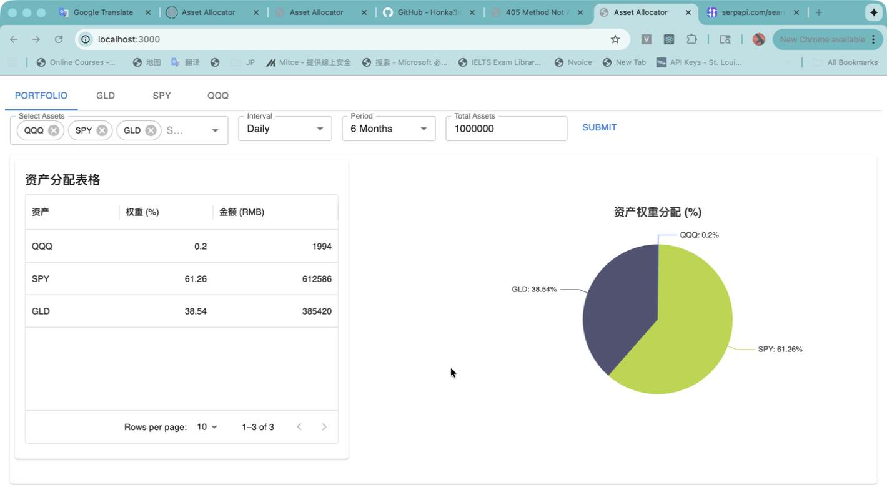
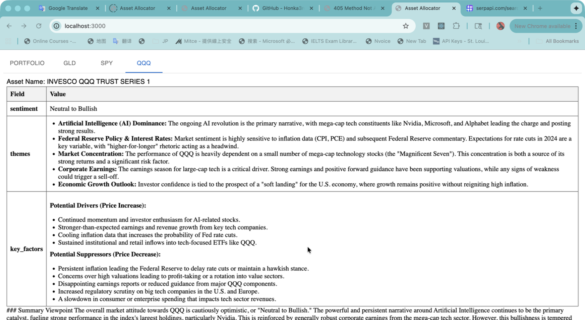
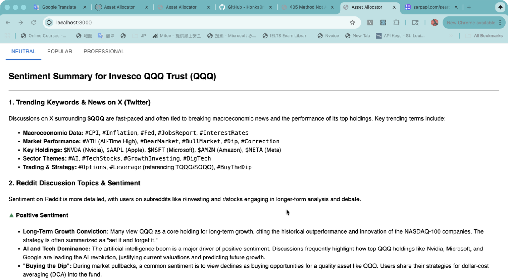

# 📊 INVEST_MODEL – AI-Powered Asset Allocation & Market Sentiment Platform

INVEST_MODEL is a **full-stack quantitative investment & sentiment analysis platform** that combines:

- ✅ **React + TypeScript frontend**
- ✅ **Node.js API layer**
- ✅ **Python Flask AI microservice (Gemini LLM)**
- ✅ **Multi-language i18n dashboard**
- ✅ **ETF portfolio allocation & visualization**
- ✅ **AI-generated sentiment & macro analysis**

This project is designed for **research-grade ETF analysis**, not just UI visualization.

---

## 🧠 What This Project Does

### 1️⃣ Portfolio Allocation Engine
Users can:
- Select assets (QQQ, SPY, GLD, etc.)
- Choose interval & time period
- Enter total capital
- Instantly calculate:
  - Asset weight (%)
  - Capital allocation (RMB)
  - Visual pie chart distribution

> This supports **strategic asset allocation & portfolio simulation**.

---

### 2️⃣ AI-Driven Market Sentiment Analysis
Each asset (e.g. QQQ) includes:
- ✅ AI-generated **sentiment summary**
- ✅ Macro-theme detection (AI, Fed policy, earnings, inflation)
- ✅ Bullish / bearish factor extraction
- ✅ News + Reddit + macro narrative synthesis

Three AI modes:
- **Neutral**
- **Popular**
- **Professional**

Powered by **Python Flask + Google Gemini LLM**.

---

### 3️⃣ Multi-Language Dashboard (i18n)
The dashboard supports:
- English
- Traditional Chinese
- Japanese

All UI labels are:
- Fully reactive
- Driven by `react-i18next`
- Dynamically switchable at runtime

---

## 🏗️ System Architecture

### Why This Design?
- ✅ AI workloads isolated in Python (better ML ecosystem)
- ✅ Frontend remains TypeScript-pure
- ✅ Node acts as a **clean inter-service bridge**
- ✅ Easier scaling & deployment later

---

## 🧩 Repository Structure

---

## 🚀 How to Run Locally

### ✅ 1️⃣ Start Python Flask AI Service

```bash
cd model_llm_service
python3 -m venv venv
source venv/bin/activate
pip install -r requirements.txt
python main.py

```
## Flask runs on:
- http://0.0.0.0:9000

## Start Node API:
```bash
cd model_web/api
npm install
npm run dev
```

## Start React Frontend:
```bash
cd model_web/app
npm install
npm run dev
```

## Python (model_llm_service/.env)
```bash
GOOGLE_LLM_API={https://aistudio.google.com/api-keys}
FLASK_HOST=0.0.0.0
FLASK_PORT=8000
```

## Node (model_web/api/.env)
```bash
FRED_API_KEY={https://fred.stlouisfed.org/docs/api/fred/v2/api_key.html}
FINNHUB_API_KEY={https://finnhub.io/dashboard}
SUR_PAPI_API_KEY={https://serpapi.com/manage-api-key}
```

📸 UI Preview





## 🧠 Key Technical Highlights
- ✅ RxJS Observables for AI streams
- ✅ InversifyJS dependency injection
- ✅ Flask microservice architecture
- ✅ Google Gemini 2.5 Flash / Pro
- ✅ ECharts financial visualization
- ✅ Multi-language i18n
- ✅ Clean LLM bridge (Node ↔ Python)

⚠️ Disclaimer

## This project is for:
- Research
- Educational
- Strategy modeling